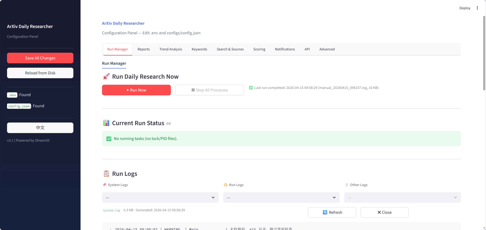
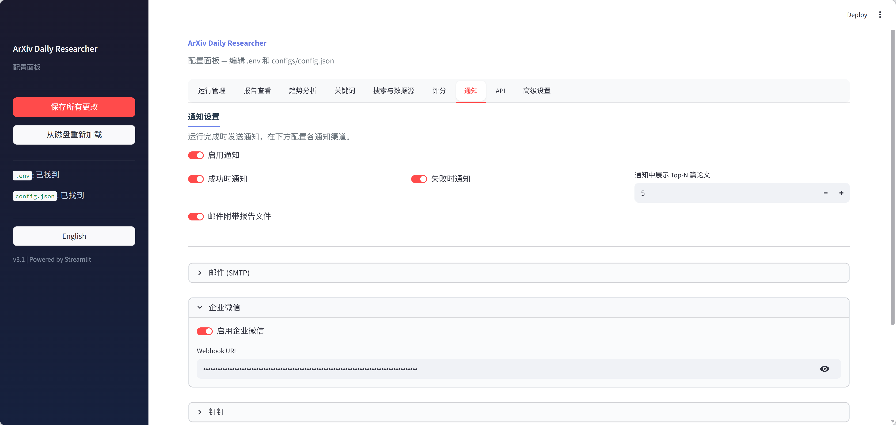
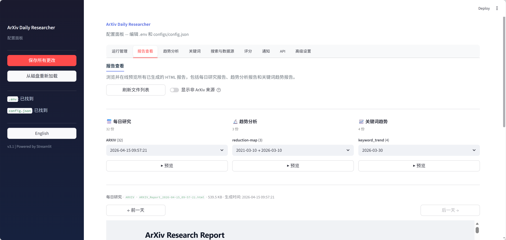
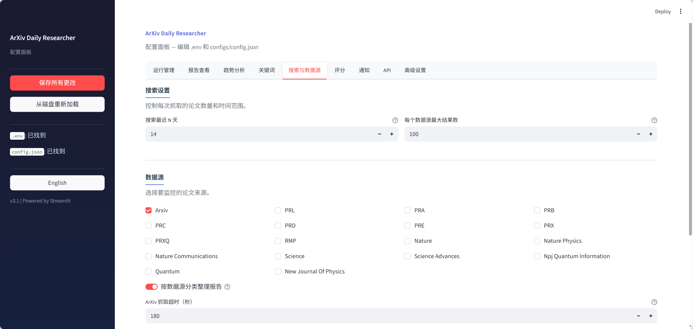

<div align="center">

# 🔬 ArXiv Daily Researcher

**基于 LLM 的智能学术论文监控、筛选、深度分析与趋势研究系统**

[](#-更新日志)
[](https://www.gnu.org/licenses/agpl-3.0)
[](https://www.python.org/downloads/)
[](https://www.docker.com/)
[](https://github.com/features/actions)
[](#️-streamlit-配置面板)

*每天接收高质量论文摘要；一行命令纵览一年研究趋势；一个面板完成配置、运行、预览与排障。*

</div>

---

ArXiv Daily Researcher 会自动从 **ArXiv** 与 **20+ 学术期刊**抓取论文，利用可配置的关键词权重评分系统筛选相关工作，下载 PDF 进行深度分析，跟踪关键词演变趋势，生成 Markdown / HTML 报告，并将结果推送到多种通知渠道。

当前版本已同时支持：
- **每日研究模式**：面向日常监控与高相关论文追踪
- **趋势研究模式**：面向指定主题的中长期趋势洞察
- **Streamlit 可视化面板**：面向日常配置、立即运行、日志查看与报告预览

---

## ✨ 核心功能

<table>
<tr>
<td colspan="2" align="center"><sub>— 数据获取 & 智能筛选 —</sub></td>
</tr>
<tr>
<td width="50%" valign="top">

### 📡 多数据源抓取

支持 **ArXiv** 与 **20+ 顶级期刊**（PRL、Nature、Science 等）。期刊论文若存在 ArXiv 版本，系统会自动切换到 ArXiv 获取更完整的摘要与可下载 PDF。可选接入 **Semantic Scholar** 补充引用数与 AI TLDR。

</td>
<td width="50%" valign="top">

### 🎯 双 LLM 评分筛选

`CHEAP_LLM` 对每篇论文按关键词逐项评分（0–10），根据**关键词权重总和**与**动态及格线**判断是否进入后续深度分析。支持主关键词、参考 PDF 自动提取关键词、专家作者加分。

</td>
</tr>
<tr>
<td colspan="2" align="center"><sub>— 深度分析 & 知识积累 —</sub></td>
</tr>
<tr>
<td width="50%" valign="top">

### 🔍 深度 PDF 分析

通过筛选的论文会自动下载 PDF，并由 `SMART_LLM` 提取 **研究方法、创新点、技术栈、关键结论、局限性、研究关联、未来方向** 七个维度。支持 **MinerU 云端解析**与 **PyMuPDF 本地解析**双模式，MinerU 不可用时自动降级。

</td>
<td width="50%" valign="top">

### 📈 关键词趋势追踪

评分阶段提取出的关键词会写入 SQLite，随后通过 AI 进行语义归并与标准化。系统可生成 Mermaid 图表与独立的 HTML 关键词趋势报告，包含**彩色柱状图、趋势热图与统一颜色图例**。

</td>
</tr>
<tr>
<td colspan="2" align="center"><sub>— 趋势研究 & 成本可观测 —</sub></td>
</tr>
<tr>
<td width="50%" valign="top">

### 🔬 趋势研究模式

独立的 `trend_research` 模式支持指定关键词、日期范围与 ArXiv 分类过滤，批量检索相关论文，逐篇生成 TLDR，并由 `SMART_LLM` **单次综合分析**热点话题、时间演变、核心研究者、研究空白与方法论趋势。

</td>
<td width="50%" valign="top">

### 📊 Token 消耗追踪

内置线程安全 Token 计数器，统计每次运行中各模型的输入 / 输出 Token 消耗，并展示在**报告末尾**与**通知消息**中，方便精确掌握运行成本。

</td>
</tr>
<tr>
<td colspan="2" align="center"><sub>— 报告输出 & 通知推送 —</sub></td>
</tr>
<tr>
<td width="50%" valign="top">

### 📄 Markdown + HTML 双格式报告

支持三类报告：**每日研究**、**趋势研究**、**关键词趋势**。Markdown 适合归档与版本管理；HTML 适合浏览器阅读与分享。HTML 报告使用外置 CSS 控制样式，并已集成 **KaTeX** 以支持公式渲染。

</td>
<td width="50%" valign="top">

### 🔔 六渠道通知

支持 **邮件、企业微信、钉钉、Telegram、Slack、通用 Webhook**。每个渠道均有独立启用开关；邮件支持 HTML 模板；错误（如 MinerU 过期、LLM 异常、网络问题）会实时告警。

</td>
</tr>
<tr>
<td colspan="2" align="center"><sub>— 配置管理 & 部署运维 —</sub></td>
</tr>
<tr>
<td width="50%" valign="top">

### 🧙 交互式配置向导

首次部署可通过 7 步 CLI 向导完成 LLM、搜索、数据源、关键词、评分、通知与高级设置。Docker 首次部署时可**自动触发**，并自动生成 `.env` 与 `configs/config.json`。

</td>
<td width="50%" valign="top">

### 🖥️ Streamlit 配置面板 <sup><kbd>v3.1</kbd></sup>

提供 **9 个 Tab** 的浏览器管理界面：配置编辑、连接测试、报告预览、运行管理、趋势分析、日志查看与状态排查全部集成在一个面板中。支持独立 WebUI Docker 容器部署。

</td>
</tr>
<tr>
<td width="50%" valign="top">

### 🚀 三种部署方式

支持 **本地脚本 + Cron**、**Docker 容器**、**GitHub Actions** 三种部署模式。既适合个人长期后台运行，也适合无服务器的轻量自动化场景。

</td>
<td width="50%" valign="top">

### 🛡️ 生产级可靠性

内置**指数退避重试**、**MinerU 智能降级**、**翻译缓存去重**、**文件锁防重并发**、**运行专用日志**、**锁超龄回收**与**自动更新检查**，适合长期无人值守运行。

</td>
</tr>
</table>

---

## 📑 导航目录

<table>
<tr>
<td width="50%" valign="top">

### 📘 快速上手

|           章节           | 简介                        |
| :----------------------: | :-------------------------- |
| [✨ 核心功能](#-核心功能) | 核心能力总览                |
| [🚀 快速开始](#-快速开始) | 三步完成首次运行            |
| [🛠️ 配置工具](#️-配置工具) | CLI 向导 + Streamlit 面板   |
| [🐳 部署方式](#-部署方式) | Docker / Actions / 本地定时 |

</td>
<td width="50%" valign="top">

### 📗 深入了解

|           章节           | 简介                         |
| :----------------------: | :--------------------------- |
| [📖 功能详解](#-功能详解) | 运行模式、报告、通知、锁机制 |
| [📁 项目结构](#-项目结构) | 目录与模块说明               |
| [❓ 常见问题](#-常见问题) | 实战排障与使用建议           |
| [📝 更新日志](#-更新日志) | 版本变更详情                 |

</td>
</tr>
</table>

---

## 🚀 快速开始

### 第一步：克隆与安装

```bash
git clone https://github.com/yzr278892/arxiv-daily-researcher.git
cd arxiv-daily-researcher
python -m venv venv && source venv/bin/activate   # Windows: venv\Scripts\activate
pip install -r requirements.txt
```

### 第二步：完成配置

推荐先运行交互式配置向导：

```bash
python src/utils/setup_wizard.py
```

向导会引导你完成：
- LLM 配置
- 搜索参数
- 数据源选择
- 关键词与研究背景
- 评分参数
- 通知渠道
- 高级设置

完成后自动生成：
- `.env`
- `configs/config.json`

> [!TIP]
> 若已有配置，向导会预填已有值；只需修改想变更的字段，其余按 Enter 保留。

<details>
<summary><b>手动配置（跳过向导）</b></summary>

**1）复制环境变量模板：**

```bash
cp .env.example .env
```

**2）填写 LLM：**

```env
CHEAP_LLM__API_KEY=sk-your-key
CHEAP_LLM__BASE_URL=https://api.openai.com/v1
CHEAP_LLM__MODEL_NAME=gpt-4o-mini

SMART_LLM__API_KEY=sk-your-key
SMART_LLM__BASE_URL=https://api.openai.com/v1
SMART_LLM__MODEL_NAME=gpt-4o
```

**3）填写核心关键词与领域：**

```jsonc
{
  "keywords": {
    "primary_keywords": {
      "weight": 1.0,
      "keywords": ["quantum error correction", "surface code"]
    },
    "research_context": "我的研究方向是容错量子计算与量子纠错码"
  },
  "target_domains": {
    "domains": ["quant-ph"]
  }
}
```

</details>

### 第三步：运行

```bash
# 每日研究模式（默认）
python main.py

# 趋势研究模式
python main.py --mode trend_research --keywords "quantum error correction"
```

运行结果默认输出到：
- 报告：`data/reports/`
- 日志：`logs/`

---

## 🛠️ 配置工具

本项目提供两种主要配置方式：**CLI 配置向导**与 **Streamlit 配置面板**。

### 🧙 交互式配置向导

适合首次部署、SSH 环境与无头服务器：

```bash
python src/utils/setup_wizard.py
```

| 步骤  | 内容     | 说明                                      |
| :---: | :------- | :---------------------------------------- |
|   1   | LLM 配置 | 选择 Provider、填写 API Key、可选连接测试 |
|   2   | 搜索设置 | 搜索天数、每源最大结果数                  |
|   3   | 数据源   | ArXiv 与期刊启用、ArXiv 分类              |
|   4   | 关键词   | 主关键词、参考 PDF 提取、研究背景         |
|   5   | 评分     | 基础分、权重系数、作者加分                |
|   6   | 通知     | 渠道启用与凭据填写                        |
|   7   | 高级设置 | PDF 解析、并发、日志保留等                |

向导写入前会自动备份已有配置到 `.bak` 文件。

---

### 🖥️ Streamlit 配置面板

#### 启动方式

```bash
# 本地运行
streamlit run src/webui/config_panel.py
```

```bash
# Docker 运行
docker compose -f docker/docker-compose.yml --profile webui up -d config-panel
```

浏览器访问：`http://localhost:8501`

配置面板与主程序共用同一套 `.env` 和 `configs/config.json`，修改后在下次任务运行时立即生效。

#### 9 个 Tab 页详解

|   #   | Tab          | 功能                                                                                                                                                                                                                     |
| :---: | :----------- | :----------------------------------------------------------------------------------------------------------------------------------------------------------------------------------------------------------------------- |
|   1   | **运行管理** | 一键立即运行每日研究；本地模式直接后台启动，Docker 模式通过写入 `data/run/webui_run_trigger.flag` 触发主容器执行；运行状态基于 `data/run/*.lock`；支持停止任务、查看状态、清理失效锁；日志区默认显示**最新且非系统日志** |
|   2   | **报告查看** | 三列展示每日研究 / 趋势研究 / 关键词趋势 HTML 报告；默认自动打开当前界面下**最新且可见**的报告，刷新后也会重新跳到最新可见报告；支持报告预览、趋势 metadata 展示、同一数据源内的前一天 / 后一天导航；可隐藏非 ArXiv 来源 |
|   3   | **趋势分析** | 在浏览器中直接设置关键词、日期范围、分类过滤、排序、最大结果数、TLDR、输出格式与 Skill，并一键启动 / 停止趋势研究任务                                                                                                    |
|   4   | **关键词**   | 管理主关键词、参考 PDF 提取、相似度阈值、权重分布、研究背景                                                                                                                                                              |
|   5   | **搜索**     | 搜索天数、单源抓取数量、数据源开关、ArXiv 分类与抓取超时                                                                                                                                                                 |
|   6   | **评分**     | 及格线公式、每关键词最高分、作者加分、是否在报告中保留未通过论文、实时评分预览                                                                                                                                           |
|   7   | **通知**     | 全局开关、成功 / 失败 / 附件控制、六大渠道配置、SMTP 测试                                                                                                                                                                |
|   8   | **API**      | 配置 CHEAP_LLM / SMART_LLM / MinerU，支持连接测试                                                                                                                                                                        |
|   9   | **高级**     | PDF 解析模式、并发、HTML 报告、Token 追踪、自动更新、关键词追踪、重试、日志轮转与锁超龄回收                                                                                                                              |

### 🖼️ WebUI 界面预览

<table>
  <tr>
    <td align="center" width="50%">
      
      <br />
      <sub>英文 WebUI 主界面</sub>
    </td>
    <td align="center" width="50%">
      
      <br />
      <sub>中文通知设置界面</sub>
    </td>
  </tr>
  <tr>
    <td align="center" width="50%">
      
      <br />
      <sub>中文报告预览界面</sub>
    </td>
    <td align="center" width="50%">
      
      <br />
      <sub>中文搜索源设置界面</sub>
    </td>
  </tr>
</table>

<details>
<summary><b>配置向导 vs 配置面板，该用哪个？</b></summary>

| 工具                             | 适用场景                    | 特点                                         |
| :------------------------------- | :-------------------------- | :------------------------------------------- |
| **配置向导** (`setup_wizard.py`) | 首次部署、SSH、无浏览器环境 | CLI 交互、适合初始化、可连接测试             |
| **配置面板** (`config_panel.py`) | 日常调参、报告预览、排障    | 9 个 Tab，所见即所得，支持运行管理与趋势分析 |

**建议**：首次安装先跑向导，后续日常使用面板更高效。

</details>

---

## 🐳 部署方式

### Docker 部署

适合长期后台运行。默认主研究容器使用 `network_mode: host`，便于直接访问宿主机本地 LLM 服务。

#### 启动

```bash
git clone https://github.com/yzr278892/arxiv-daily-researcher.git
cd arxiv-daily-researcher
cp .env.example .env
docker compose -f docker/docker-compose.yml up -d
```

默认容器行为：
- `CRON_SCHEDULE=0 8 * * *`
- `RUN_ON_STARTUP=true`
- `MODE=cron`
- `SETUP_WIZARD=auto`

也就是说，默认会：
1. 首次部署时自动检查是否需要启动配置向导
2. 容器启动后立即运行一次
3. 后续每天 08:00 自动执行

#### 常用命令

```bash
# 查看运行状态
docker compose -f docker/docker-compose.yml ps

# 查看日志
docker compose -f docker/docker-compose.yml logs -f

# 启动 / 停止 WebUI
docker compose -f docker/docker-compose.yml --profile webui up -d config-panel
docker compose -f docker/docker-compose.yml --profile webui down

# 容器内直接执行趋势研究
docker exec -it arxiv-daily-researcher python main.py --mode trend_research \
  --keywords "quantum error correction" \
  --date-from 2025-01-01 \
  --categories quant-ph

# 停止主服务
docker compose -f docker/docker-compose.yml down
```

#### WebUI 立即运行机制

WebUI 通过共享卷写入触发文件来请求主容器执行任务，无需挂载 Docker Socket：
- WebUI 写入：`data/run/webui_run_trigger.flag`
- 主容器 `entrypoint.sh` 中的 `trigger_watcher` 每 5 秒轮询
- 检测到后启动 `python main.py --mode daily_research`
- 运行日志写入 `logs/manual_*.log`
- 真正的 Python PID 写入 `data/run/webui_triggered.pid`

这种方式适合 NAS、受限宿主机和不便暴露 Docker Socket 的环境。

<details>
<summary><b>容器环境变量</b></summary>

| 变量             | 默认值          | 说明                                               |
| :--------------- | :-------------- | :------------------------------------------------- |
| `TZ`             | `Asia/Shanghai` | 时区                                               |
| `CRON_SCHEDULE`  | `0 8 * * *`     | 每日定时执行时间                                   |
| `RUN_ON_STARTUP` | `true`          | 启动时立即运行一次                                 |
| `MODE`           | `cron`          | `cron` 为定时模式，`run-once` 为单次执行           |
| `SETUP_WIZARD`   | `auto`          | `auto` 首次自动触发，`true` 强制触发，`false` 跳过 |

</details>

<details>
<summary><b>使用本地 LLM（Ollama 等）</b></summary>

由于主研究容器使用 `network_mode: host`，可以直接访问宿主机上的本地服务：

```env
CHEAP_LLM__API_KEY=ollama
CHEAP_LLM__BASE_URL=http://127.0.0.1:11434/v1
CHEAP_LLM__MODEL_NAME=qwen2.5:7b
```

</details>

---

### GitHub Actions 云端运行

适合没有常驻服务器的场景。

支持两个工作流：
- `daily-run.yml`：每日研究
- `trend-research.yml`：手动趋势研究

#### 配置步骤

1. Fork 本仓库
2. 进入 **Settings → Secrets and variables → Actions**
3. 配置至少以下 Secrets：

| Secret 名称            | 必填  | 说明                         |
| :--------------------- | :---: | :--------------------------- |
| `CHEAP_LLM_API_KEY`    |   ✅   | 低成本 LLM API Key           |
| `CHEAP_LLM_BASE_URL`   |   ✅   | 低成本 LLM API 地址          |
| `CHEAP_LLM_MODEL_NAME` |   ✅   | 低成本 LLM 模型              |
| `SMART_LLM_API_KEY`    |   ✅   | 高性能 LLM API Key           |
| `SMART_LLM_BASE_URL`   |   ✅   | 高性能 LLM API 地址          |
| `SMART_LLM_MODEL_NAME` |   ✅   | 高性能 LLM 模型              |
| 通知相关 Secrets       | 可选  | SMTP / Telegram / Webhook 等 |

> [!NOTE]
> `daily-run.yml` 中的 `schedule:` 默认是注释掉的。Fork 后请先配置 Secrets，再取消注释定时触发，避免空配置导致失败。

#### 手动趋势研究

`trend-research.yml` 支持传入：
- `keywords`
- `date_from`
- `date_to`
- `categories`
- `sort_order`
- `max_results`

报告会作为 Artifact 保存 30 天。

---

### 本地定时运行（系统 Cron）

如果你不想使用 Docker 或 GitHub Actions，也可以直接使用系统 Cron：

```bash
crontab -e
0 8 * * * cd /path/to/arxiv-daily-researcher && ./scripts/run_daily.sh >> /tmp/arxiv-cron.log 2>&1
```

---

## 📖 功能详解

### 🔄 两种运行模式

| 维度     | `daily_research`（默认）       | `trend_research`               |
| :------- | :----------------------------- | :----------------------------- |
| 定位     | 每日自动追踪最新论文           | 指定主题的长期趋势分析         |
| 数据源   | ArXiv + 期刊                   | ArXiv                          |
| 时间范围 | 最近 N 天                      | 任意日期区间                   |
| 筛选方式 | 关键词加权评分                 | 无评分，全量保留               |
| 核心分析 | 高分论文 PDF 深度分析          | 全量 TLDR + 趋势综合分析       |
| 触发方式 | Cron / Docker / Actions / 面板 | CLI / 面板 / Actions           |
| 输出路径 | `data/reports/daily_research/` | `data/reports/trend_research/` |

### 📅 每日研究流水线

```text
1. 准备关键词与动态及格线
2. 从 ArXiv / 期刊抓取论文
3. 跳过历史已处理论文
4. 使用 CHEAP_LLM 逐关键词评分
5. 提取并追踪论文关键词
6. 对通过筛选的论文执行 PDF 深度分析
7. 生成 Markdown / HTML 报告
8. 发送通知
```

### 🔬 趋势研究流水线

```text
1. 按关键词、日期、分类搜索 ArXiv
2. 逐篇生成 TLDR
3. 由 SMART_LLM 综合分析五个维度
4. 输出 Markdown / HTML / metadata.json
5. 推送趋势分析通知
```

### 🎯 动态及格线公式

当前配置文件中的默认示例为：

```text
及格线 = base_score + weight_coefficient × Σ(关键词权重)
```

在当前仓库默认 `configs/config.json` 中：
- `base_score = 1.5`
- `weight_coefficient = 2.5`

你可以在：
- `评分` Tab
- 或 `configs/config.json > scoring_settings.passing_score_formula`

中自由调整宽松 / 严格程度。

### 📡 数据源与 ArXiv 优先策略

- ArXiv：使用官方 `arxiv` Python 库抓取
- 期刊：通过 OpenAlex 获取最新论文
- 若期刊论文存在 ArXiv 版本，优先切换到 ArXiv 元数据与 PDF
- 可选接入 Semantic Scholar 获取引用数与 AI TLDR

### 🔍 PDF 解析与智能降级

支持两种解析方式：

| 模式      | 优点                         | 限制                |
| :-------- | :--------------------------- | :------------------ |
| `mineru`  | 结构化效果更好，适合复杂论文 | 需要 Token          |
| `pymupdf` | 纯本地、零外部依赖           | 解析质量受 PDF 影响 |

当 MinerU 不可用时，系统会自动降级到 PyMuPDF，避免整次任务失败。

### 📈 关键词趋势追踪

关键词追踪模块会：
- 将原始关键词写入 SQLite
- 用 AI 对关键词做批量标准化
- 生成频率统计与趋势图
- 输出独立 HTML 关键词趋势报告

常用配置项：
- `keyword_tracker.enabled`
- `keyword_normalization_enabled`
- `keyword_normalization_batch_size`
- `keyword_report_frequency`

### 🔒 并发运行互斥锁

为避免重复运行，系统使用 `fcntl` 文件锁：

| 模式             | 锁文件                                 |
| :--------------- | :------------------------------------- |
| `daily_research` | `data/run/daily_research.lock`         |
| `trend_research` | `data/run/trend_research_<hash8>.lock` |

特点：
- 相同任务重复启动时直接安全退出
- 锁文件写入 PID 与启动时间
- 支持**超龄锁回收**（默认 12 小时）
- 回收失败时保守退出，避免双实例并发

### ⏱️ ArXiv 抓取超时守卫

ArXiv 抓取已加入硬超时保护：
- 配置项：`data_sources.arxiv.fetch_timeout_seconds`
- 当前默认值：`180`
- 单个领域超时后会重试并记录日志

### 📄 报告系统

#### 每日研究报告

路径：
- `data/reports/daily_research/markdown/<source>/`
- `data/reports/daily_research/html/<source>/`

内容通常包括：
- 统计摘要
- 通过论文详情
- 未通过论文列表
- 深度分析结果
- 关键词趋势图
- Token 消耗统计

#### 趋势研究报告

路径：
- `data/reports/trend_research/markdown/<keyword_slug>/`
- `data/reports/trend_research/html/<keyword_slug>/`

同时生成：
- `*_metadata.json`

#### 关键词趋势报告

路径：
- `data/reports/keyword_trend/markdown/`
- `data/reports/keyword_trend/html/`

### 🔔 通知系统

支持六个渠道：
- Email
- 企业微信
- 钉钉
- Telegram
- Slack
- 通用 Webhook

通知开关分为两层：
1. 全局通知总开关
2. 各渠道独立开关

渠道只有在**配置已填写**且**对应 enabled=true** 时才会真正发送。

---

## 📁 项目结构

```text
arxiv-daily-researcher/
├── main.py                          # CLI 入口，按模式分发
├── .env.example                     # 环境变量模板
├── requirements.txt                 # Python 依赖
├── README.md
│
├── src/
│   ├── config.py                    # 全局配置加载
│   ├── modes/                       # 两种运行模式
│   │   ├── daily_research.py
│   │   └── trend_research.py
│   ├── agents/                      # LLM 分析相关 Agent
│   ├── sources/                     # ArXiv / OpenAlex / 搜索编排
│   ├── report/                      # daily / trend / keyword_trend 报告生成
│   ├── notifications/               # 多渠道通知
│   ├── parsers/                     # PDF 解析
│   ├── keyword_tracker/             # 关键词追踪与标准化
│   ├── utils/                       # 配置、日志、锁、Token、向导等工具
│   └── webui/                       # Streamlit 配置面板
│       ├── config_panel.py
│       ├── i18n.py
│       └── tabs/
│           ├── run_manager.py
│           ├── reports.py
│           ├── trend_runner.py
│           ├── keywords.py
│           ├── search.py
│           ├── scoring.py
│           ├── notifications.py
│           ├── llm.py
│           └── advanced.py
│
├── configs/
│   ├── config.json                  # 主配置文件（JSONC）
│   └── templates/                   # 报告、通知、邮件模板
│
├── docker/
│   ├── Dockerfile
│   ├── Dockerfile.webui
│   ├── docker-compose.yml
│   └── entrypoint.sh
│
├── scripts/                         # 运行脚本与 Makefile
├── assets/                          # README / WebUI 预览图片
├── data/                            # 运行数据（自动创建）
└── logs/                            # 系统日志与每次运行日志
```

---

## ❓ 常见问题

<details>
<summary><b>1. 如何立即运行一次每日研究？</b></summary>

有三种方式：

```bash
python main.py
```

或通过 Docker 主容器定时 / 启动执行，或通过 WebUI 的 **运行管理** Tab 点击「立即运行」。WebUI 的立即运行通过触发文件机制完成，无需 Docker Socket。

</details>

<details>
<summary><b>2. 为什么运行管理默认显示的不是 system.log？</b></summary>

日志查看器默认优先显示**时间最新且非系统日志**的文件，便于第一时间查看最近一次真实任务输出，而不是长期滚动的 `system.log`。

</details>

<details>
<summary><b>3. 趋势研究模式支持哪些参数？</b></summary>

常用 CLI 示例：

```bash
python main.py --mode trend_research \
  --keywords "quantum error correction" \
  --date-from 2025-01-01 \
  --date-to 2026-01-01 \
  --categories quant-ph cond-mat \
  --sort-order ascending \
  --max-results 500
```

同样的参数也可以在 WebUI 的 **趋势分析** Tab 中直接设置。

</details>

<details>
<summary><b>4. 任务提示“已在运行中”，但我怀疑是残留锁怎么办？</b></summary>

系统已经支持：
- 死进程残留锁自动清理
- 超龄锁自动回收

如果仍需手动处理，可先确认 PID 不存在，再删除 `data/run/*.lock`。WebUI 的运行管理状态区也支持清理失效锁。

</details>

<details>
<summary><b>5. Docker 中如何访问宿主机本地 LLM？</b></summary>

主研究容器默认使用 `network_mode: host`，通常直接写 `127.0.0.1` 即可：

```env
CHEAP_LLM__BASE_URL=http://127.0.0.1:11434/v1
```

</details>

<details>
<summary><b>6. MinerU 失败了怎么办？</b></summary>

系统会自动降级到 PyMuPDF，不会因为 MinerU 不可用而导致整次任务直接失败。你也可以在：
- WebUI 的 **API** Tab 测试 MinerU
- WebUI 的 **高级** Tab 或 `config.json` 中切换到 `pymupdf`

</details>

<details>
<summary><b>7. 如何调整通过筛选的论文数量？</b></summary>

主要调整两处：
- `base_score`
- `weight_coefficient`

更低的基础分 / 系数会让更多论文通过；更高则更严格。

</details>

<details>
<summary><b>8. 可以同时运行两个不同关键词的趋势研究吗？</b></summary>

可以。趋势研究锁是基于**关键词 + 日期 + 分类**做参数哈希的：
- 相同参数互斥
- 不同参数可并行

</details>

<details>
<summary><b>9. 报告查看中的前一天 / 后一天导航是怎么工作的？</b></summary>

导航按钮只在**同一数据源 / 同一分组**内部按日期跳转，不跨来源。同一天有多份报告时，跳转到目标日期中最新的一份。

</details>

<details>
<summary><b>10. 哪些内容最适合用 WebUI 来做？</b></summary>

推荐通过 WebUI 完成：
- 日常调参
- 连接测试
- 立即运行任务
- 查看运行状态
- 浏览日志
- 预览 HTML 报告
- 启动趋势研究

首次部署或纯终端环境仍建议优先使用 CLI 配置向导。

</details>

---

## 📜 许可证

本项目采用 [AGPL-3.0](https://www.gnu.org/licenses/agpl-3.0.html) 许可证。

| 条款       | 说明                                     |
| :--------- | :--------------------------------------- |
| ✅ 使用     | 可自由使用、修改、分发                   |
| ✅ 商用     | 允许商业使用                             |
| 📋 源码公开 | 修改后的版本须公开源代码并使用相同许可证 |
| 🌐 网络使用 | 通过网络提供服务时也须公开源代码         |
| 📝 声明     | 需保留原始版权声明和许可证               |

---

## 📝 更新日志

<table>
<tr><th>版本</th><th>日期</th><th>类型</th><th>亮点</th></tr>
<tr><td><b>v3.1</b></td><td>2026-04-15</td><td>✨ 增强 + 🐛 修复</td><td>运行管理 Tab、日志查看器升级、趋势分析 Tab、报告查看增强、ArXiv 超时守卫、运行锁超龄回收</td></tr>
<tr><td><b>v3.0</b></td><td>2026-03-09</td><td>✨ 重大更新</td><td>研究趋势模式、趋势分析 GitHub Actions 工作流、综合趋势分析、Token 追踪、配置向导自动触发、并发运行互斥锁、运行专用日志、Streamlit 配置面板（含报告查看）、关键词趋势 HTML 报告</td></tr>
<tr><td><b>v2.3</b></td><td>2026-03-09</td><td>✨ 增强</td><td>邮件 HTML 模板、通知渠道独立开关</td></tr>
<tr><td><b>v2.2</b></td><td>2026-03-03</td><td>📦 重构 + 🐛 修复</td><td>模块化拆分、11 项 Bug 修复</td></tr>
<tr><td><b>v2.1</b></td><td>2026-03-03</td><td>📋 许可证 + ✨ 功能</td><td>AGPL-3.0、通知模板、错误告警</td></tr>
<tr><td><b>v2.0</b></td><td>2026-03-03</td><td>📦 重构 + ✨ 重大更新</td><td>src 结构、Docker、通知、Actions、HTML 报告、MinerU</td></tr>
<tr><td><b>v1.3</b></td><td>2026-03-01</td><td>🐛 修复</td><td>OpenAlex 严重 Bug、关键词标准化</td></tr>
<tr><td><b>v1.2</b></td><td>2026-02-08</td><td>🐛 修复+ ⚡优化 + ✨ 增强</td><td>翻译缓存、ArXiv 优先策略</td></tr>
<tr><td><b>v1.1</b></td><td>2026-02-05</td><td>✨ 增强</td><td>跨平台运行脚本</td></tr>
<tr><td><b>v1.0</b></td><td>2026-02-06</td><td>🎉 首次发布</td><td>多源抓取、智能评分、PDF 分析、关键词趋势</td></tr>
</table>

### ✅ v3.1 — 2026-04-15

<details>
<summary><b>✨ 新功能 / 重构（7 项）</b></summary>

1. **运行管理 Tab 完全重构** —— 统一本地模式与 Docker 模式的立即运行体验；支持停止任务、查看状态、清理失效锁。
2. **日志查看器升级** —— 日志区域按”系统日志 / 运行日志 / 其他日志”三栏分组，选中即展示，共享同一内容区；默认优先展示**时间最新且非系统日志**，更符合实际排障习惯。
3. **趋势分析 Tab 完整双语化** —— 趋势分析界面的参数、状态、按钮、Skill 标签等文本全部纳入 i18n，中文 / English 切换更完整。
4. **趋势分析配置收口到独立 Tab** —— 趋势研究相关的排序、最大结果数、TLDR、输出格式与 Skill 选择统一放入「趋势分析」Tab，避免高级设置页过度拥挤。
5. **ArXiv 抓取超时守卫** —— 新增 `data_sources.arxiv.fetch_timeout_seconds` 配置，使用硬超时保护单个领域抓取，超时后自动重试并输出清晰日志。
6. **运行锁超龄回收** —— 对超过 `run_lock.max_age_hours` 的任务尝试自动终止旧进程并回收锁，降低前一次异常退出导致次日任务被阻塞的概率。
7. **报告查看增强** —— 默认自动打开当前可见范围内最新的报告；刷新后重新跳转到最新可见报告；非 ArXiv 来源默认关闭，聚焦最常用报告。

</details>

<details>
<summary><b>🐛 Bug 修复（4 项）</b></summary>

1. **报告日期导航修复** —— 修复同一日期有多份报告时，前一天 / 后一天导航可能错误定位的问题，改为基于唯一日期集合跳转，并返回目标日期内最新报告。
2. **报告查看默认噪音降低** —— 非 ArXiv 来源在报告查看中默认关闭，首次进入界面时更聚焦最常用报告。
3. **日志默认选择逻辑修复** —— 运行管理页首次进入时，不再默认打开系统日志，而是优先显示最新的实际运行日志 / 趋势日志 / 其他非系统日志。
4. **i18n 条目补齐** —— 新增并补齐运行管理、日志查看、趋势分析等相关翻译项，避免双语模式下出现遗漏文本。

</details>

---

### ✅ v3.0 — 2026-03-09

<details>
<summary><b>✨ 新功能（11 项）</b></summary>

1. **研究趋势分析模式** — 全新 `trend_research` 运行模式，支持指定关键词和时间范围批量检索 ArXiv 论文，LLM 逐篇生成 TLDR（无评分），SMART_LLM 单次调用综合分析五个维度（热点话题、时间演变、核心研究者、研究空白、方法论趋势）。单次可处理 500+ 篇论文，大量论文自动分批处理再合并。CLI 通过 `--mode trend_research --keywords "..."` 启动，支持 `--date-from`、`--date-to`、`--sort-order`、`--max-results`、**`--categories`**（ArXiv 分类过滤）参数。报告按 `keyword_slug/date_range` 目录存储，同步输出 Markdown + HTML + metadata.json（`src/modes/trend_research.py`、`src/agents/trend_agent.py`、`src/report/trend/reporter.py`）

2. **趋势分析 Skills 系统** — 趋势分析使用外置 JSON 配置的指导提示，五个分析维度合并为一个综合 Skill 单次调用，大幅降低 Token 消耗和调用时间。支持在 `config.json` 中配置启用的 Skill（`configs/templates/reports/trend_skills.json`）

3. **研究趋势专属通知模板** — 新增研究趋势分析成功/失败通知模板（Markdown + HTML），包含搜索关键词、时间范围、论文数量、TLDR 生成数、分析维度数等统计信息（`configs/templates/notifications/research_success.md`、`configs/templates/email/research_success.html`）

4. **Token 消耗追踪** — 新增全局 Token 计数器（`src/utils/token_counter.py`），线程安全单例，对所有 LLM 调用（`analysis_agent.py`、`trend_agent.py`、`keyword_agent.py`、`normalizer.py`）无侵入式埋点，按模型统计输入/输出 Token 数。每次运行结束后展示在：每日/趋势报告 Markdown 和 HTML 末尾（"Token 消耗统计"章节，含按模型明细表）、所有通知渠道消息（企业微信/钉钉/Telegram/Slack/邮件）。通过 `config.json` 中 `token_tracking.enabled`（默认 `true`）一键开启/关闭，禁用后所有统计和展示均跳过

5. **关键词趋势 HTML 报告** — 新增 `KeywordTrendReporter`（`src/report/keyword_trend/`），生成独立 HTML 趋势报告，使用 CSS 彩色水平柱状图（代替 Mermaid）、颜色编码图例表格和趋势热图，每个关键词贯穿所有视图共享一种颜色。Markdown 报告中 Mermaid 柱状图 X 轴改为序号标注（避免关键词名称拥挤），提供图例对照表。报告存储于 `data/reports/keyword_trend/markdown/` 和 `html/`

6. **交互式配置向导 + Docker 自动触发** — `src/utils/setup_wizard.py` CLI 配置向导，基于 questionary + rich，7 步引导完成全部配置。已有配置的必填字段（如 API Key）可直接回车跳过，未配置的必填字段强制要求输入。Docker 首次部署（无 `.env` 文件时）自动运行向导，也可通过 `SETUP_WIZARD=true` 环境变量强制触发（`src/utils/setup_wizard.py`、`docker/entrypoint.sh`）

7. **Streamlit 配置面板** — 新增 `src/webui/` 浏览器配置面板，6 个配置 Tab 页覆盖所有配置项，支持 LLM 连接测试、SMTP 测试、实时计算评分预览。独立 `Dockerfile.webui` + `docker-compose.yml` 的 `profiles: [webui]` 集成，256 MB 内存即可运行（`src/webui/`、`docker/Dockerfile.webui`）

8. **运行专用日志文件** — 每次运行自动创建独立日志文件：每日研究 → `logs/daily_YYYYMMDD_HHMMSS.log`，趋势研究 → `logs/trend_YYYYMMDD_HHMMSS.log`，所有 logger 输出同步写入。Docker 容器自动清理超期日志。不再依赖仅有的 `system.log`，方便追溯每次运行的完整记录（`src/utils/logger.py`、`main.py`）

9. **统一依赖管理** — WebUI 容器不再使用独立的 `requirements-webui.txt`，改为与主容器共用同一个 `requirements.txt`，减少维护负担（`docker/Dockerfile.webui`）

10. **并发运行互斥锁** — 新增 `src/utils/run_lock.py`，基于 `fcntl.LOCK_EX | LOCK_NB` 文件锁，防止同一任务被重复并发触发（cron 迟滞叠加、手动触发与定时任务重叠等场景）。`daily_research` 使用全局互斥；`trend_research` 按参数哈希（关键词 + 日期 + 分类的 MD5 前 8 位）独立互锁，相同参数的任务互斥，不同参数可安全并行。已锁定时以退出码 `0` 退出，不触发失败通知。锁文件在进程退出时自动清理（`src/utils/run_lock.py`、`main.py`）

11. **Streamlit 报告查看器** — 配置面板新增「报告查看」Tab，三列并排展示全部类型报告文件（每日研究按 Source 分组、趋势分析按关键词 Slug 分组、关键词趋势独立列），日期/时间戳自动格式化（如 `2026-03-10  12:27:47`、`2025-03-10 → 2026-03-10`）；点击 ▶ 预览后页内嵌入渲染 HTML（高度可调 600–2000 px）；趋势报告自动读取同目录 `_metadata.json` 显示运行参数摘要；WebUI Docker 容器新增 `data/` 只读挂载（`docker-compose.yml`）（`src/webui/tabs/reports.py`、`docker/docker-compose.yml`）

</details>

<details>
<summary><b>📦 架构变更（5 项）</b></summary>

11. **双模式 CLI 入口** — `main.py` 新增 `argparse` 命令行解析，通过 `--mode` 参数选择运行模式（`daily_research` 或 `trend_research`），默认保持 `daily_research`，所有现有行为完全不变。Docker 和 GitHub Actions 继续使用每日模式（`main.py`）

12. **报告目录重组** — 所有报告统一归入 `data/reports/` 下，按类型分目录：`daily_research/[markdown|html]/[source]/`（每日研究）、`trend_research/[markdown|html]/[keyword]/`（趋势研究，报告以 `{date_range}.md` / `{date_range}.html` / `{date_range}_metadata.json` 命名，扁平存放于关键词目录下）、`keyword_trend/[markdown|html]/`（关键词趋势）。Docker、GitHub Actions、config.json 同步更新

13. **`modes/` 目录完整化** — 将每日研究流水线从 `main.py` 的 `main()` 函数提取为 `DailyResearchPipeline` 类，移至 `src/modes/daily_research.py`，与 `trend_research.py` 对齐。`main.py` 精简为纯路由器，仅负责参数解析与模式分发（`src/modes/daily_research.py`、`main.py`）

14. **`report/` 目录按模式拆分** — 将平铺的 `reporter.py`、`trend_reporter.py`、`modules/` 按运行模式重组为 `report/daily/`（含 `reporter.py` + `modules/`）、`report/trend/`（含 `reporter.py`）、`report/keyword_trend/`（含 `reporter.py`），各子包独立导出，`report/__init__.py` 统一对外暴露

15. **配置管理基础模块** — 新增 `src/utils/config_io.py`，为配置向导和 Streamlit 面板提供统一的 `.env` / `config.json` 双向读写能力。支持 JSONC 注释保留（block header）、写前自动备份（`.bak`）、LLM 连接验证、SMTP 连接验证和 flat/nested 配置互转

</details>

---

### ✅ v2.3 — 2026-03-09

<details>
<summary><b>✨ 新功能（2 项）</b></summary>

1. **邮件通知 HTML 精美模板** — 邮件通知全面升级为 HTML 格式，告别 Markdown 在邮件客户端的排版问题。6 个模板（运行成功/失败 + 4 种错误告警）采用响应式卡片设计，含深色 Header、彩色状态徽章、统计数字看板、数据源表格、Top-N 论文卡片和报告路径列表，内嵌 inline CSS 兼容主流邮件客户端（Gmail、Outlook、QQ 邮件等）。纯文本版本作为备用同时发送，保证降级兼容。模板存放于 `configs/templates/email/`，支持完全自定义，其他渠道（企业微信/钉钉/Telegram/Slack）继续使用原有 Markdown 模板（`configs/templates/notifications/`），两套体系互不干扰（`src/notifications/notifier.py`）

2. **通知渠道独立开关** — `configs/config.json` 中 `notifications.channels` 新增各渠道的 `enabled` 开关，可精细控制每个渠道的启用状态，无须再通过删除密钥来禁用特定渠道。渠道生效条件：`enabled: true` **且** `.env` 中填有对应密钥，两者缺一则静默跳过（`src/config.py`、`src/notifications/notifier.py`）

</details>

---

### ✅ v2.2 — 2026-03-03

<details>
<summary><b>📦 源代码结构重构（1 项）</b></summary>

1. **按功能模块拆分 `src/agents/` 目录** — 原 `agents/` 中混合了 LLM Agent 和非 LLM 功能代码，现按职责拆分为独立模块：`agents/`（仅 LLM Agent）、`sources/`（数据源 + 搜索编排）、`report/`（报告生成 + 渲染器）、`notifications/`（通知推送）、`parsers/`（PDF 解析）、`keyword_tracker/`（关键词追踪），所有导入路径同步更新

</details>

<details>
<summary><b>🐛 Bug 修复（4 项关键修复 + 7 项中等修复）</b></summary>

2. **修复 JSON 转义修复器正则表达式失效** — `_clean_json_string` 中的正则终止符 `\"` 导致仅匹配以转义引号结尾的字符串值，LLM 返回含 LaTeX 反斜杠的 JSON 时无法修复，静默降级到错误默认值（`analysis_agent.py`）
3. **修复并发模式下历史记录读取的竞态条件** — `is_processed()` 未加锁读取共享字典，并发时可能导致同一论文被重复评分和分析（`base_source.py`）
4. **修复并发模式下 SQLite "database is locked" 错误** — 启用 WAL 日志模式和 30 秒超时，避免多线程同时写入关键词数据库时锁冲突丢失数据（`database.py`）
5. **修复并发模式下临时 PDF 文件名冲突** — 使用 MD5 哈希 + 线程 ID 生成唯一临时文件名，避免多线程下载同一 PDF 时相互覆盖（`analysis_agent.py`）
6. **修复 PDF 文件句柄泄漏** — `_extract_text_from_pdf` 使用 `with` 上下文管理器确保异常时也能正确关闭 PyMuPDF 文档（`keyword_agent.py`）
7. **修复 OpenAlex 分页数日志 Off-by-one** — 页码计数器提前自增导致日志报告的页数始终比实际多 1（`openalex_source.py`）
8. **修复合成 DOI 生成无效 URL** — OpenAlex 中无真实 DOI 的论文（`openalex:W12345` 格式）不再生成无效的 `doi.org` 链接，改用 OpenAlex 页面 URL（`openalex_source.py`）
9. **修复关键词缓存目录未创建导致保存静默失败** — 在保存缓存前自动创建 `data/keywords/` 目录，避免首次运行时提取的参考关键词丢失（`keyword_agent.py`）
10. **修复 `INSERT OR IGNORE` 后 `lastrowid` 不可靠** — 改用 `cursor.rowcount > 0` 判断是否实际插入成功，避免重复记录（`database.py`）
11. **修复参考 PDF 关键词分配逻辑** — 超过 5 个新 PDF 时，未分析的 PDF 不再被错误分配相同的关键词（`keyword_agent.py`）
12. **修复 `git rev-list` 返回码未检查** — 命令失败时不再因解析空输出触发 `ValueError`（`updater.py`）

</details>

---

### ✅ v2.1 — 2026-03-03

<details>
<summary><b>📋 许可证变更（1 项）</b></summary>

1. **许可证从 CC BY-NC-SA 4.0 变更为 AGPL-3.0** — 更适合开源软件项目的许可协议，允许商业使用，要求衍生作品公开源代码

</details>

<details>
<summary><b>✨ 新功能（2 项）</b></summary>

2. **通知消息 Markdown 模板系统** — 通知消息改用可自定义的 Markdown 模板渲染，适配企业微信等支持 Markdown 的平台。模板文件存放于 `configs/notification_templates/`，包含运行成功（`success.md`）、运行失败（`failure.md`）及多种错误告警模板，用户可直接修改模板自定义通知样式和内容
3. **运行时错误实时告警通知** — 新增错误告警通知机制，当 MinerU API Token 过期、额度耗尽、LLM API 异常、网络连接失败等错误发生时，立即通过配置的通知渠道推送告警，包含错误详情和处理建议（模板文件：`error_mineru.md`、`error_llm.md`、`error_network.md`、`error_generic.md`）

</details>

<details>
<summary><b>🗑️ 清理（1 项）</b></summary>

4. **移除临时文档** — 删除不再需要的 `mineruapi.md` 文件

</details>

---

### ✅ v2.0 — 2026-03-03

<details>
<summary><b>📦 项目结构重构（5 项）</b></summary>

1. **源代码目录化** — 所有 Python 源代码迁入 `src/` 目录（`config.py`、`agents/`、`utils/`），`main.py` 保留在根目录
2. **配置文件集中管理** — 新增 `configs/` 目录，`search_config.json` 重命名为 `configs/config.json`，`report_templates/` 迁入 `configs/`
3. **运行脚本集中管理** — `run_daily.sh`、`run_daily_mac.sh`、`run_daily.ps1` 和 `Makefile` 统一迁入 `scripts/`
4. **Docker 文件集中管理** — `Dockerfile`、`docker-compose.yml` 迁入 `docker/` 目录，构建上下文指向项目根目录
5. **精简 `.gitignore` / `.dockerignore`** — 移除大量冗余规则，只保留项目实际需要的条目

</details>

<details>
<summary><b>✨ 新功能（15 项）</b></summary>

6. **自动更新检查** — 每次运行前自动从 GitHub 拉取最新代码，支持本地修改暂存/恢复，网络异常不阻塞（新增 `src/utils/updater.py`）
7. **Docker 一键部署** — 新增 `Dockerfile`、`docker-compose.yml` 和容器入口脚本，支持 `MODE=run-once`、`RUN_ON_STARTUP`，多架构构建（AMD64 + ARM64）
8. **多渠道通知系统** — 支持邮件、企业微信、钉钉（含 HMAC 签名）、Telegram、Slack、通用 Webhook，通知包含 Top-N 高分论文，成功/失败可分别配置
9. **GitHub Actions 定时工作流** — 每天 UTC 00:00 触发，支持手动触发，API Key 通过 Secrets 管理，报告作为 Artifact 保存 30 天
10. **自动重试机制** — 基于 tenacity 的指数退避重试，覆盖 LLM 调用、PDF 下载、OpenAlex / Semantic Scholar API
11. **并发处理** — 可选多线程加速评分和深度分析，`ThreadPoolExecutor` 实现，翻译缓存和历史记录均线程安全
12. **HTML 报告生成** — 可选同步输出 HTML 报告，卡片式响应式布局，深度分析可折叠，统计栏含通过率
13. **MinerU 云端 PDF 解析** — 新增 MinerU API 作为默认解析方式，支持 `pipeline`/`vlm` 两种模型，自动检测 Token 过期和额度耗尽，不可用时智能降级（新增 `src/agents/mineru_parser.py`）
14. **HTML 报告 CSS 外置** — 样式从 `configs/report_templates/html_report.css` 加载，通过 CSS 变量控制主题色，修改即生效
15. **报告目录结构优化** — Markdown 和 HTML 报告分离存放至 `data/reports/markdown/[source]/` 和 `data/reports/html/[source]/`
16. **关键词数据目录整理** — `keywords.db` 和 `keywords_cache.json` 统一迁入 `data/keywords/` 子目录
17. **日志轮转管理** — 按天或按大小（5 MB）两种轮转模式，可配置保留天数；Docker 容器额外自动清理过期 cron/startup 日志
18. **按数据源单独配置搜索数量** — 新增 `max_results_per_source`，未配置者回退到全局默认值
19. **Makefile 便捷命令** — `make run` / `make run-once` / `make logs` / `make build-multi` 等 Docker 快捷操作
20. **VSCode 工作区配置** — 新增 `.vscode/extensions.json`（推荐插件）和 `.vscode/settings.json`（自动指向 venv、Black 格式化、Flake8 检查）

</details>

<details>
<summary><b>🐛 Bug 修复（2 项）</b></summary>

21. **修复翻译缓存节省统计逻辑反转** — `cache_savings` 计算公式错误，导致日志中节省提示永远不打印（`main.py`）

</details>

---

### ✅ v1.3 — 2026-03-01

<details>
<summary><b>🐛 Bug 修复（3 项）</b></summary>

1. **修复 OpenAlex 数据源每页只处理最后一篇论文的严重 Bug** — `for item in results:` 循环中去重、标题/作者/摘要提取等逻辑缩进错误，导致每页只有最后一篇被处理，大量论文被静默跳过
2. **修复关键词标准化 JSON 解析失败** — LLM 将 JSON 包裹在 Markdown 代码块中返回时直接报错。在 `normalizer.py` 新增 `_extract_json()` 自动剥离代码块；`keyword_agent.py` 同步修复，补充无语言标注代码块的处理
3. **修复关键词标准化 JSON 截断问题** — `batch_size=50` 时 LLM 输出易超 token 上限导致 JSON 不完整。将默认值从 50 改为 25，同步更新四处配置

</details>

---

### ✅ v1.2 — 2026-02-08

<details>
<summary><b>🐛 重要修复（1 项）</b></summary>

1. **修复 OpenAlex 源缩进错误** — 标题、作者、摘要提取代码无法执行（此问题后在 v1.3 中被更全面修复）

</details>

<details>
<summary><b>⚡ 性能优化（2 项）</b></summary>

2. **翻译缓存机制** — 新增 MD5 哈希缓存，同一摘要（ArXiv 与期刊重复时）只翻译一次
3. **KeywordTracker 实例优化** — 移到处理循环外初始化，减少数据库连接开销

</details>

<details>
<summary><b>✨ 功能增强（2 项）</b></summary>

4. **ArXiv 优先策略** — 期刊论文有 ArXiv 版本时自动切换，获取完整元数据
5. **增强 Semantic Scholar 集成** — 改进 ArXiv 版本检测逻辑，同时获取 TLDR

</details>

---

### ✅ v1.1 — 2026-02-05

<details>
<summary><b>运行脚本增强（4 项）</b></summary>

1. 新增虚拟环境自动检测与创建功能
2. 新增 macOS 运行脚本（`run_daily_mac.sh`）
3. 新增 Windows PowerShell 脚本（`run_daily.ps1`）
4. 增强 Linux 运行脚本（`run_daily.sh`）

</details>

---

### ✅ v1.0 — 2026-02-06

<details>
<summary><b>首次正式发布（6 项）</b></summary>

1. 多数据源支持（ArXiv + 20+ 学术期刊，基于 OpenAlex）
2. 智能评分系统（关键词加权 + 动态及格线）
3. 深度 PDF 分析（LLM 驱动，PyMuPDF 本地解析）
4. 关键词趋势追踪（SQLite 存储 + Mermaid 可视化）
5. AI 关键词标准化（批量语义归并）
6. Markdown 报告生成（按数据源分目录）

</details>

---

## 🤝 API 使用说明

本项目遵循各 API 提供方的使用规范，确保合规调用：

| API                  | 合规措施                                                                |
| :------------------- | :---------------------------------------------------------------------- |
| **ArXiv**            | 使用官方 `arxiv` Python 库，内置 6 秒请求延迟                           |
| **OpenAlex**         | 请求头包含联系方式，建议配置 `OPENALEX_EMAIL` 进入礼貌池（Polite Pool） |
| **Semantic Scholar** | 请求头含 User-Agent，支持配置 API Key 获取更高速率                      |
| **MinerU**           | 遵守每日 2000 页优先级额度限制，超出后自动降至普通优先级                |

> [!NOTE]
> 所有外部 API 调用均配有指数退避自动重试机制，网络波动不会导致运行中断。

---

## 🙏 致谢

- 感谢 [Claude](https://www.anthropic.com/claude) 与 [Claude Code](https://claude.ai/code) 在本项目开发过程中的辅助
- 感谢 [ArXiv](https://arxiv.org/)、[OpenAlex](https://openalex.org/)、[Semantic Scholar](https://www.semanticscholar.org/) 提供开放学术数据
- 感谢 [MinerU](https://mineru.net/) 提供云端 PDF 解析能力

---

<div align="center">

如果这个项目对你有帮助，欢迎点一个 **Star** ⭐

[](https://star-history.com/#yzr278892/arxiv-daily-researcher&Date)

[](https://github.com/yzr278892/arxiv-daily-researcher/issues)
[](mailto:yzr278892@gmail.com)

</div>
